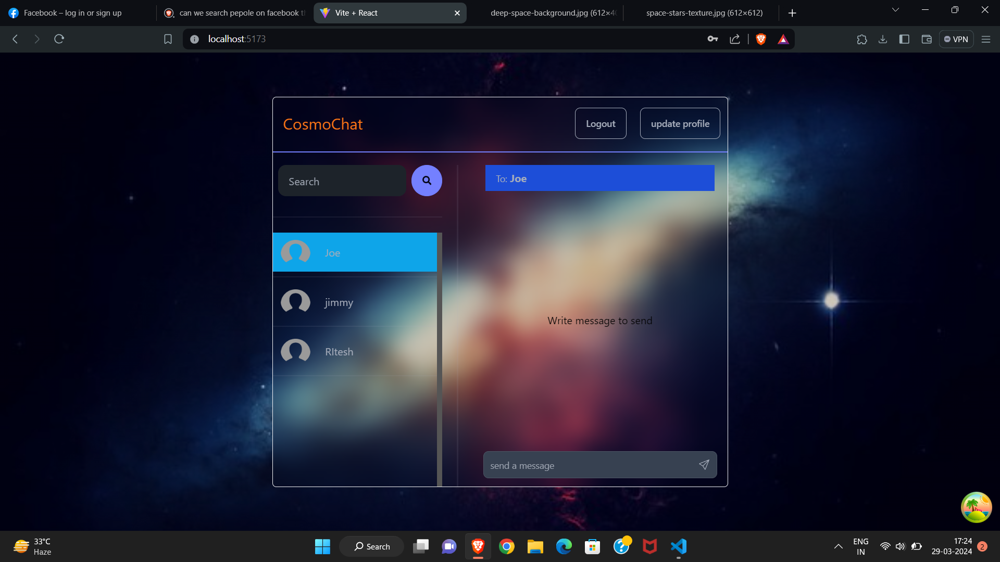

# MERN Stack Project: Building a Real Time Chat App | JWT, Socket.io



Some Features:

- 🌟 Tech stack: MERN + Socket.io + TailwindCSS + Daisy UI
- Authentication && Authorization with JWT
- Real-time messaging with Socket.io
- Online user status (Socket.io)
- Client state management with Zustand
- Server state management with Tanstack query
- Error handling both on the server and on the client

### Setup .env file

```js
PORT=...
MONGO_DB_URI=...
JWT_SECRET=...
NODE_ENV=...
CLOUDINARY_CLOUD_NAME=...
CLOUDINARY_API_KEY=...
CLOUDINARY_API_SECRET = ...
```

### Build the app

```shell
cd ./server
npm install
cd ../chat_ui
npm install
```

### Start the app

```shell
cd ./server
npm run dev
cd ../chat_ui
npm run dev
```
